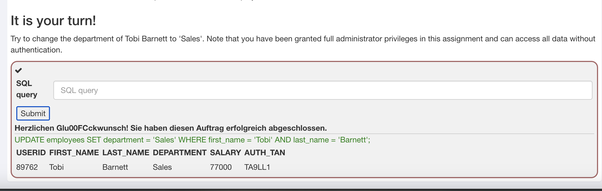
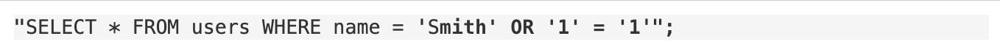
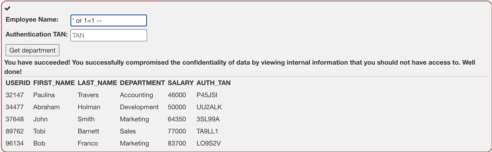
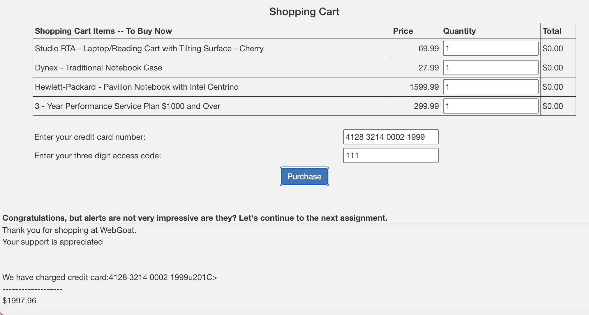
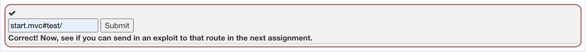

## Readme von Andrej Boroja und Gentian Beqiraj

### Webgoat Aufgaben Erklärung

Bei unserem Securityproblem gab es auf Webgoat sehr viele Aufgaben, deshalb haben wir wie
abgesprochen fünf rausgepickt und erklären hier diese.

#### Aufgabe 1.3

Die Data Manipulation Language (DML) umfasst SQL-Befehle wie SELECT, INSERT, UPDATE und DELETE, 
die für das Abrufen, Einfügen, Aktualisieren und Löschen von Daten in einer Datenbank verwendet 
werden. SELECT dient zum Abfragen von Daten, INSERT zum Einfügen neuer Datensätze, UPDATE zur 
Aktualisierung bestehender Daten und DELETE zum Löschen von Datensätzen. Diese Befehle sind sehr 
mächtig, unsachgemässe Nutzung durch Angriffe wie SQL-Injection kann die Sicherheit und Integrität
von Daten gefährden. Bei dieser Aufgabe musste ein bestehender Datensatz verändert werden und
deswegen muss UPDATE verwendet werden.

#### Aufgabe 1.9

Diese Injektion funktioniert, weil or '1' = '1' immer zu true ausgewertet wird
(Das string ending literal für '1' wird von der Abfrage selbst geschlossen, daher sollte man es nicht injizieren). 
Die injizierte Abfrage sieht also im Wesentlichen wie folgt aus: SELECT * FROM user_data WHERE first_name = 'John' and last_name = '' 
oder TRUE, was immer zu true ausgewertet wird, egal was davor kam.

#### Aufgabe 1.11

Hier wird eine SQL-Injection-Schwachstelle in einem internen System ausgenutzt, um auf vertrauliche Informationen,
wie die Gehälter aller Mitarbeiter, zuzugreifen. Durch das Einfügen der Zeichenkette ' OR 1=1 -- in das Namensfeld 
wird die SQL-Abfrage so manipuliert, dass sie immer wahr ist und alle Datensätze zurückgibt. Diese Aktion hat die 
Vertraulichkeit der Daten verletzt und zeigt, wie wichtig es ist, Benutzereingaben richtig zu validieren und SQL-Injections zu verhindern.

#### Aufgabe 4.7

Lösung: 4128 3214 0002 1999“>

In dieser Aufgabe wurde XSS (Cross-Site Scripting) identifiziert, indem das Eingabefeld für die Kreditkartennummer mit
4128 3214 0002 1999"> manipuliert wurde. Nach dem Absenden des Formulars wurde das alert(1)
Script ausgeführt, was zeigt, dass das Feld anfällig für XSS-Angriffe ist, da die Eingabe ungefiltert in die Seite eingefügt wurde.
Diese Methode verdeutlicht , dass man Benutzereingaben serverseitig zu validieren hat, um Sicherheitslücken zu vermeiden.

#### Aufgabe 4.10

In dieser Aufgabe habe wir nach einer Möglichkeit für DOM-basiertes Cross Site Scripting gesucht. Dazu habe wir den Code der
Anwendung geprüft und eine Route gefunden, die unsicheren Testcode enthält. Die Basisroute für diesen Testcode ist start.mvc#test/. 
Diese Route war in der Produktionsversion der Anwendung geblieben, was die Möglichkeit gab, sie für einen Cross Site Scripting Angriff zu nutzen.